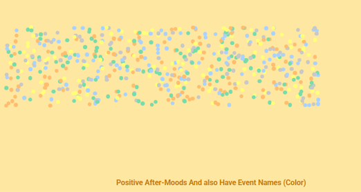
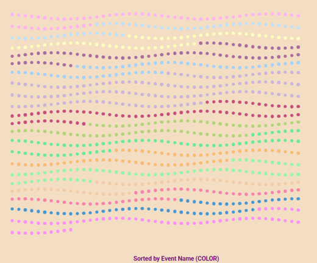
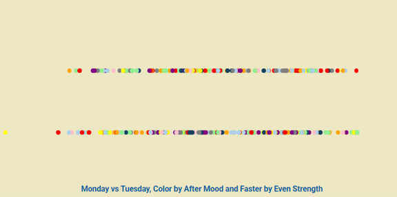
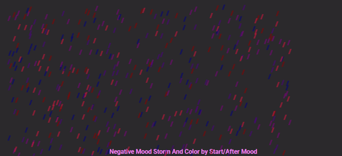

## Explanation of MongoDB Queries and Visualizations

### Project Overview
This project loads data from a MongoDB collection and allows the user to view the results using  a dropdown menu.
Each menu option triggers a different MongoDB query and shows a different visualization on the website.


### Query 3 — Filter by Positive After-Mood

```@app.route("/three")
def three():
    results = mongo.db.dataStuff.find({"after_mood": {"$in": positive_moods}})
    return {"results": results, "positive_moods": positive_moods}
```
#### ```"after_mood": {"$in": positive_moods}```
This query returns all entries where the after_mood of the participant is positiv; happy, neutral, calm, serene and well.
The query checks if after_mood IN [happy, neutral, calm, serene, well]. Therefore, the result contains only the dataset items where people ended their day in a positive mood.

#### ```return {"results": results, "positive_moods": positive_moods}```
Sends the results filtered by positive moods to the webpage.

### Screenshot Query 3


#### Inspiration:
Positive moods feel light, happy, calm and uplifting.
To represent this, I made each data point behave like a bubble floating upward.

#### Design Choices:
- Color = event_name
- Soft colors → represent calmness and happiness
- Bubbles → summer, joy and light 
- Upward movement animation → symbolizing positivity = lifting up “mood”


### Query 4 — Sort by Event Name

```@app.route("/four")
def four():
    results = mongo.db.dataStuff.find().sort("event_name", 1)
    return {"results": results, "events": event_names}
```
#### ```.sort("event_name", 1)```
This query sorts all the entries alphabetically by the event_name field. Therefore, if the database has events such as; walking in a forest, swimming in the ocean, dining with sibling, taking a nap with a cat, it will be returned in alphabetically order.

#### ```return {"results": results, "events": event_names}```
Sends the sorted results to the webpage.


### Screenshot Query 4


#### Inspiration:
- Since this query sorts events alphabetically, I chose a clean grid layout.
- To make it more unique and fun, I added a wave animation.

#### Design Choices:
- Grid layout → represents sorting and organization
- Different event colors → helps visualize each category
- Wave animation → adds liveliness 
- Hover growth → fun interactive touch

### Query 5 — Monday or Tuesday

```app.route("/five")
def five():
    results = mongo.db.dataStuff.find({
        "day": {"$in": ["Monday", "Tuesday"]}
    }).sort("event_affect_strength", 1)

    return {"results": results, "days": ["Monday", "Tuesday"]}
```
#### ```day": {"$in": ["Monday", "Tuesday"]}```
This query extracts only the entries where day is “Monday” or “Tuesday”. 

#### ```.sort("event_affect_strength", 1)```
The results are sorted by their event_affect_strength.

#### ```return {"results": results, "days": ["Monday", "Tuesday"} ```
Sends the filtered and sorted results to the webpage.

### Screenshot Query 5


#### Inspiration:
Since Monday and Tuesday are two separate days, I showed them as two lanes, each points are following each other like cars, representing traffic on working days.

#### Design Choices:
- Colors based on mood – helps visualize each mood
- Top lane = Monday
- Bottom lane = Tuesday
- Data points behave like “cars” 
- Speed is based on event_affect_strength - stronger emotional impact = faster car

### Query 6 — Negative Mood Filter
Select cases where the participant felt negative before and after the event, organized by weather.


```@app.route("/six")
def six():
    results = mongo.db.dataStuff.find({
        "start_mood": {"$in": negative_moods},
        "after_mood": {"$in": negative_moods}
    }).sort("weather", 1)

    return {"results": results, "negatives": negative_moods}
```
#### ```"start_mood": {"$in": negative_moods}``` & ```"after_mood": {"$in": negative_moods}```
Both returns entries where both of the following: start_mood and after_mood is negative which are sad, angry, neutral, calm, anxious, moody and hurt.

#### ```.sort("weather", 1)```
Sorts all results by weather type in alphabetical order.

#### ```return {"results": results, "negatives": negative_moods}```
Sends the filtered results to the webpage.

### Screenshot Query 6


#### Inspiration:
Negative feeling feels unstable, tense, or stressful. The lightning theme represents the emotional stresses on our body.

#### Design Choices:
- Deep colors represent sad/angry moods
- Dark background – stormy atmosphere
- Thin shapes points make it looks like lighting when jittering 
- Gentle jitter animation → represents stress
- Flickering opacity → keeps the lightning effect 


